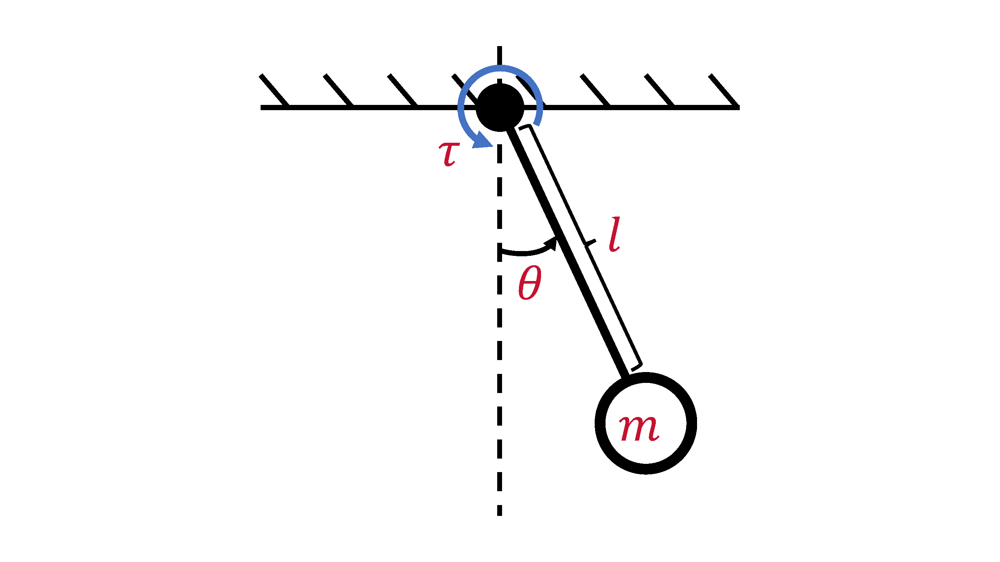
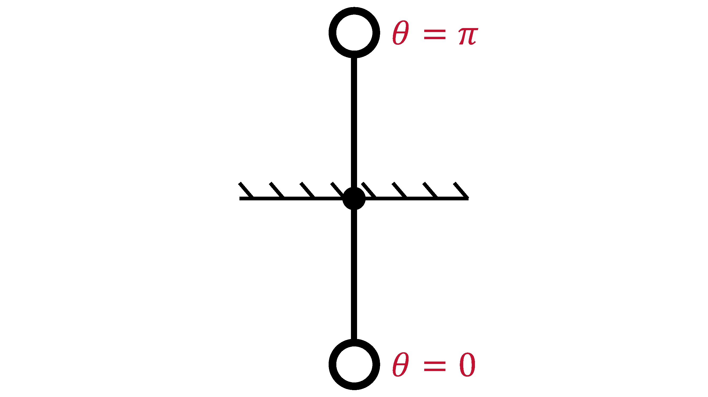
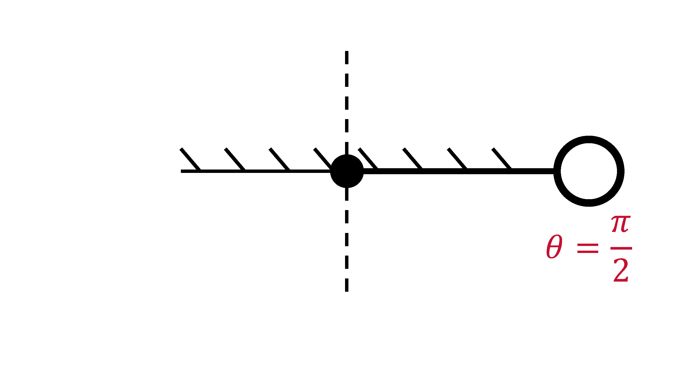
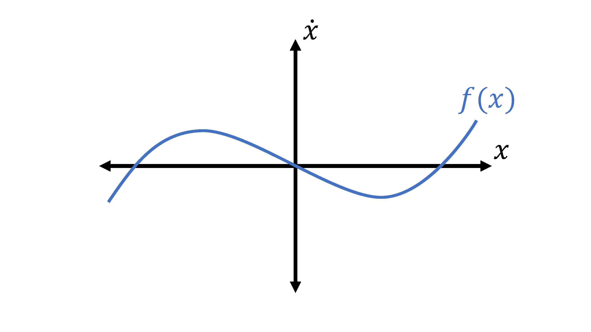
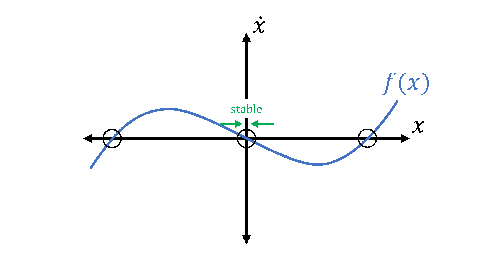
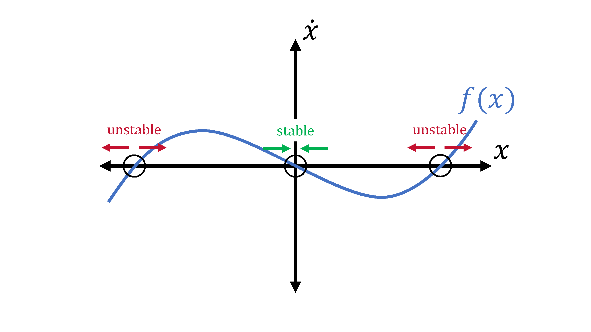

# 1. Continuous-Time Dynamics & Equilibria

## Topics Covered

- Introduction
- Motivating Example (Pendulum)
- Continuous-Time Dynamics
- Equilibria

## Introduction

To start things off, we're going to go through some background material. Specifically, we're first going to provide a crash course on dynamics, which defines the behavior of many robotics systems that we will later attempt to "control" to do what we want. Before we do "optimal control," we need to understand what we're going to control and what it means to control a robot.

**Disclaimer:** This course will have an emphasis on **robotics applications, specifically mechanical systems,** but many of the methods are applicable to other types of systems such as chemical processes, which is where optimal control actually originated from.

We'll begin with a high-level overview of **continuous-time dynamics, equilibria, and stability** to provide a background to those unfamiliar with topics like dynamics and differential equations. This will provide a *basic* foundation to describe how robotic systems move and interact with their environment. In later lectures, we will learn how to *discretize* them to make them useful for computers (e.g., our future controllers).

## Motivating Example (Pendulum)

Let's start with a real-life example: a **pendulum**, the world's simplest nonlinear dynamical system (or robot),

where we have a point mass of mass $m$ subject to gravity, $g$, while being suspended by a massless rod of length $l$ that can swing about a pivot point.

If we want to describe the motion of the pendulum, we need to:

1. Define scalar variables that *represent/parameterize* the system,
2. Describe how those variables *evolve* to explain the system's behavior.

In the case of the pendulum, we somehow want to parameterize its swinging motion. First, we need to way to characterize *where* the pendulum is during the swing; one way of doing so is keeping track of the pendulum's **angle**, $\theta$, which gives us one variable. However, that's not enough - if we want to be able to know where the pendulum will be in the future (i.e., how it will evolve), we also need to know how *fast* its swinging. Therefore, let's also keep track of the pendulum's **angular velocity**, $\dot{\theta}$. To be concise, we can stack our variables into a *vector* $\in \mathbb{R}^{2}$ (i.e., in 2D space of real numbers):

$$
x = \begin{bmatrix}
    \theta\\
    \dot{\theta}
\end{bmatrix}.
$$

Now, we can use those variables (along with physics) to describe how the pendulum swings in the form of a **ODE (ordinary differential equation)**:

$$
ml^{2}\ddot{\theta} + mgl\sin(\theta) = \tau,
$$

where $\tau \in \mathbb{R}$ is the **torque** applied to the pendulum. Just like before with the variables, we can express this ODE in a vector form:

$$
f(x, u) = \begin{bmatrix}
    \dot{\theta}\\
    \ddot{\theta}
\end{bmatrix} = \begin{bmatrix}
    \dot{\theta}\\
    -\frac{g}{l}\sin(\theta) + \frac{1}{ml^{2}}u
\end{bmatrix},
$$

where $u = \tau$. To provide names to everything, we call $x$ the pendulum's **state** and $f(x, u)$ the pendulum's **dynamics model**. 

Now, let's say we want to make the pendulum "do something." Let's say we want to make it rotate counter-clockwise. Then we need to apply some sort of *input* to the system. In the pendulum's case, we can apply a torque (from an imaginary motor at the base) which we defined as $u$. As hinted at earlier, we call $u$ our **control input**.

## Continuous-Time Dynamics

### General Form

While the pendulum is a nice, specific, real-life example, we need to be able to express things more generally to extend the same idea to other systems. The most general/generic way to write continuous-time dynamics for a *smooth sytem* is in the form,

$$
\dot{x} = f(x, u).
$$

Just like we did for the pendulum, we call $f$ the **dynamics**, $x \in \mathbb{R}^{n}$ the **state** (assume a vector for now), and $u \in \mathbb{R}^{m}$ the **input**. From a robotics perspective, smooth means that it doesn't involve things like rigid contact that cause discontinuous/switching behaviors. We'll study this in greater detail in later lectures.

Specifically for a mechanical system (most things in robotics), the state can be split into 2 pieces:

$$
x = \begin{bmatrix}
    q\\
    v
\end{bmatrix},
$$

where $q$ is called the **configuration/pose** and $v$ is the **velocity**. In the case of the pendulum, the configuration would be the angle, and the velocity would be the angular velocity:

$$
\begin{align}
    q & = \theta, \\
    v & = \dot{\theta}.
\end{align}
$$

**NOTE:** $q$ is not always a vector. For example, in the case of the pendulum, we kind of lied... $\theta$ can only be between $0$ and $2\pi$. Therefore, we say the $q \in \mathbb{S}^{1}$ (i.e., in a 1D circle). If $\dot{\theta}$ can be any real number, then what does $x$ look like? **HINT:** it's not $\mathbb{R}^{2}$.

### Control-Affine Systems

Often times, we see common structures across so many dynamical systems that we give them labels. One kind is called **control-affine systems**, which is in the form,

$$
\dot{x} = f_{0}(x) + B(x)u,
$$

where $f_{0}$ is called the **drift** term, and $B(x)$ is known as the **input Jacobian**. This expression essentially just means that the dynamics is linear with respect to $u$. It turns out most systems, including *all* mechanical systems, can be written in this form. In the case of the pendulum:

$$
f_{0}(x) = \begin{bmatrix}
    \dot{\theta}\\
    -\frac{g}{l}\sin(\theta)
\end{bmatrix},\quad B(x) = \begin{bmatrix}
    0\\
    \frac{1}{ml^{2}}
\end{bmatrix}.
$$

### Manipulator Dynamics

If we get even more specific, we'll find another form that's very common in robotics. In fact, this specific form once again encompasses *all* mechanical systems. We call it the **manipulator equation**, which we write as

$$
M(q)\dot{v} + C(q, v) = B(q)u + F,
$$

where $M(q)$ is called the **mass matrix**, $C(q, v)$ is the **dynamic bias**, $B(q)$ is again the **input Jacobian**, and $F$ represents all other **external forces**. As we noted before, $q$ is not always a vector, which implies that in a lot of cases, $\dot{q} \neq v$. Therefore, we must generally say that

$$
\dot{q} = G(q)v.
$$

We call this expression the **velocity kinematics**, and this will show up a lot in *3D rotations* (e.g., quaternions, rotation matrices, and if you're sadistic... Euler angles), which we'll study in later lectures. 

When applied to our pendulum example, the manipulator equation's terms are

$$
M(q) = ml^{2}, \quad C(q, v) = mgl\sin(\theta), \quad B = I, \quad G=I.
$$

Practically speaking, a lot of existing robotics toolboxes/packages will provide these terms for you so that we don't have to do heinous, complicated physics to get them - hurray!

Remember, we still need our dynamics model to describe $\dot{x}$ (how our states evolve). Massaging the manipulator equation to do so gives us

$$
\dot{x} = f(x, u) = \begin{bmatrix}
    G(q)v\\
    M(q)^{-1}[B(q)u + F - C]
\end{bmatrix}.
$$

One nice thing about this is that $M(q)$ is *always invertible* if we make good choices for the coordinates of $x$. In addition, inverting $M(q)$ is the most expensive operation here, which limits the time-complexity of solving this equation to $O(n^{3})$. This is good because we care about speed; our controller has to run in real-time when on an actual robot. Unfortunately, this can still be expensive for a big robot with a lot of links (e.g., humanoid), but there are smarter ways of dealing with this that can be $O(n)$.

**NOTE:** Practically speaking, you should almost never solve for $M(q)^{-1}$ directly. As alluded to earlier, there are applicable, smart solvers/methods for solving linear systems ($Ax=b$) that can achieve $O(n)$.

### Linear Systems

Linear systems are our most specific, but still widely-used form of modeling dynamical systems. In fact, it's hard to overstate just how *important* linear systems are in control theory; we can solve them exactly in closed-form, analyze their behaviors rigorously, and approximate many systems with linear models. In fact, they're so well-studied that there are whole classes/textbooks on them, but for our purposes, we'll provide a high-level overview here.

As hinted by the name, linear systems have the form:

$$
\dot{x} = A(t)x + B(t)u.
$$

If $A(t)$ and $B(t)$ are constant (i.e., $A(t) = A$, $B(t) = B$), then the system is called **time invariant**. The system is **time varying** otherwise.

As previously mentioned, linear systems are *super important* in control, one of those reasons being that we often *approximate* nonlinear systems *locally* with linear ones using **Taylor series**:

$$
\dot{x} = f(x, u) \quad \Rightarrow \quad A=\frac{\partial f}{\partial x}, \quad B = \frac{\partial f}{\partial u}.
$$

It turns out this works surprisingly well in controls; so well that we can often design bread-and-butter controllers with the *linearized* model and still run it successfully in *nonlinear* settings (e.g., the real world). This is usually a good first step!

## Equilibria

### Definition

Switching gears a little bit, let's now talk about another *super important* topic in dynamics, which is **equilibria**. Intuitively, this is a point where a system will "remain at rest." Algebraically, the equilibria, $x_{eq}$, are the roots of our dynamics, where

$$
\dot{x} = f(x, u) = 0.
$$

In the case of the pendulum, the equilibria are where our pendulum is pointing straight down and upright respectively; if we leave the pendulum at those spots, it shouldn't move. We can determine the points (i.e., the states) that correspond to the equilibria:

$$
\dot{x} = \begin{bmatrix}
    \dot{\theta}\\
    -\frac{g}{l}\sin{\theta}
\end{bmatrix} = \begin{bmatrix}
    0 \\
    0
\end{bmatrix} \quad \Rightarrow \quad x_{eq} = \begin{bmatrix}
    0 \\
    0
\end{bmatrix}, \begin{bmatrix}
    \pi \\
    0
\end{bmatrix}.
$$

### First Control Problem

Let's use this opportunity to solve our first control problem: what $u$ do we need to apply to move the equilibria to $\theta = \frac{\pi}{2}$?

Using the expression of equilibria for our pendulum, we can solve for $u$ accordingly:

$$
\begin{align}
    \dot{x} = \begin{bmatrix}
        \dot{\theta}\\
        -\frac{g}{l}\sin{\theta} + \frac{1}{ml^{2}}u
    \end{bmatrix} & = \begin{bmatrix}
        0 \\
        0
    \end{bmatrix}, \\
    \space \\
    \Rightarrow \frac{1}{ml^{2}}u & = \frac{g}{l}\sin{\theta}, \\
    \space \\
    \Rightarrow u & = mgl.
\end{align}
$$

Like this pendulum example, we *generally* get a root-finding problem in $u$:

$$
f(x^{*}, u) = 0
$$

### Stability of Equilibria

Not only do we care about *where* the equilibria are, but also how **stable** they are. This is absolutely another *core* concept in control, so we strongly suggest you pay attention. What we're generally asking with regard to **stability** is the following: **"when will we stay stay 'near' an equilibrium point under perturbations?"**

We'll demonstrate by example by looking at a made-up, stupid-looking 1D system ($x \in \mathbb{R}$) with no control inputs:

We can mark the equilibria by finding the roots, which are circled in black. Let's look at the middle one first; if we choose a point just to its right, the sign of $\dot{x}$ is negative, which is going to push us *back* to the equilibrium. If we choose a point on the left, then the positive $\dot{x}$ is also going to push us back towards the equilibrium. Because we'll wind up back at the equilibrium from any direction, we call the middle equilibrium point a **stable** equilibrium.

If we look at either the left or the right equilibrium, we can play the same game; if we choose a point close but to the right, the sign of $\dot{x}$ is positive, which is going to push us *away* from the equilibrium. A point on the left will also push us away, so no matter what, we'll be moving away from the equilibrium. As you can guess, we call the left and right equilibrium points **unstable** equilibria.

From a more mathematical standpoint, we can see that the derivatives of $f$ at the equilibria determine the stability:

$$
\begin{align}
    \frac{\partial f}{\partial x}\Bigg|_{x_{eq}} & < 0 \quad \Rightarrow \quad \text{stable}, \\
    \space \\
    \frac{\partial f}{\partial x}\Bigg|_{x_{eq}} & > 0 \quad \Rightarrow \quad \text{unstable}. \\
\end{align}
$$

In the case of the pendulum, we can intuitively see that the bottom and upright equilibria correspond to a stable and unstable one respectively. However, for this higher-dimensional system, how do we come up with a mathematically equivalent version? We know that the higher-dimensional equivalent to a scalar derivative is the Jacobian ($\frac{\partial f}{\partial x}$), but what's the equivalent to the Jacobian being positive or negative? 

The answer lies in the eigenvalues! Let us linearize the dynamics at an equilibrium and perform an eigendecomposition of $\frac{\partial f}{\partial x}$:

$$
\begin{align}
    \dot{x} & = \frac{\partial f}{\partial x}\Bigg|_{x_{eq}}x, \\
    \space \\
    \Rightarrow \dot{x} & = \underbrace{\Bigg[\begin{smallmatrix}
        | & & | \\
        v_{1} & \cdots  & v_{n} \\
        | & & | \\
    \end{smallmatrix}\Bigg]}_{T} \underbrace{\Bigg[\begin{smallmatrix}
    \lambda_{1} & & 0 \\
    & \ddots & \\
    0 & & \lambda_{n}
    \end{smallmatrix}\Bigg]}_{\Lambda} \underbrace{\Bigg[\begin{smallmatrix}
        | & & | \\
        v_{1} & \cdots  & v_{n} \\
        | & & | \\
    \end{smallmatrix}\Bigg]^{-1}}_{T^{-1}} x \\
    \Rightarrow \dot{x} & = T \Lambda T^{-1}x, \\
    \space \\
    \Rightarrow T^{-1}\dot{x} & = \Lambda T^{-1}x, \\
\end{align}
$$

where $v_{i} \in \mathbb{R}^{n}$ is the $i$th eigenvector of $\frac{\partial f}{\partial x}$ and $\lambda_{i} \in \mathbb{C}$ (i.e., a complex scalar) is the corresponding eigenvalue. By relabeling the linear mapping, $T^{-1}x$, as a new vector, $z$, we can now analyze the system in terms of $z$:

$$
\begin{align}
    \Rightarrow \dot{z} & = \Lambda z, \\
    \space \\
    \Rightarrow \dot{z} & = \Bigg[\begin{smallmatrix}
    \lambda_{1} & & 0 \\
    & \ddots & \\
    0 & & \lambda_{n}
    \end{smallmatrix}\Bigg]z, \\
\end{align}
$$

then we can see that we essentially decoupled the higher-dimensional system into *multiple 1D* systems. Therefore we can evaluate the real parts of each eigenvalue of $\frac{\partial f}{\partial x}$ in a similar manner as before with the scalar case:

$$
\begin{align}
    \text{Re}\Big(\text{eigvals}\Big[\frac{\partial f}{\partial x}\Big|_{x_{eq}}\Big]\Big) & < 0 \quad \Rightarrow \quad \text{stable}, \\
    \space \\
    \text{Re}\Big(\text{eigvals}\Big[\frac{\partial f}{\partial x}\Big|_{x_{eq}}\Big]\Big) & > 0 \quad \Rightarrow \quad \text{unstable}. \\
\end{align}
$$

**NOTE:** If *any* of the eigenvalues' real parts is positive, then the system is *unstable*. Also, remember to evaluate $\frac{\partial f}{\partial x}$ at the equilibrium of interest!

Applying our stability analysis to the pendulum:

$$
\begin{align}
    f(x) & = \begin{bmatrix}
        \dot{\theta}\\
        -\frac{g}{l}\sin{\theta}
    \end{bmatrix} \quad \Rightarrow \quad \frac{\partial f}{\partial x} = \begin{bmatrix}
        0 & 1 \\
        -\frac{g}{l}\cos{\theta} & 0
    \end{bmatrix}, \\
    \space \\
    \space \\
    \frac{\partial f}{\partial x} \Bigg|_{\theta = \pi} & = \begin{bmatrix}
        0 & 1 \\
        \frac{g}{l} & 0
    \end{bmatrix} \quad \Rightarrow \quad \text{eigvals}\Big(\frac{\partial f}{\partial x}\Big|_{\theta = \pi}\Big) = \pm \sqrt{\frac{g}{l}}, \\
    \space \\
    \frac{\partial f}{\partial x} \Bigg|_{\theta = 0} & = \begin{bmatrix}
        0 & 1 \\
        -\frac{g}{l} & 0
    \end{bmatrix} \quad \Rightarrow \quad \text{eigvals}\Big(\frac{\partial f}{\partial x}\Big|_{\theta = 0}\Big) = 0 \pm i\sqrt{\frac{g}{l}}. \\
\end{align}
$$

As expected, at $\theta = \pi$, a positive real component of an eigenvalue $\Big(\sqrt{\frac{g}{l}}\Big)$ exists, so the pendulum is unstable about the upright equilibrium. This matches our intuition.

At $\theta = 0$, we see that the real components of the eigenvalues are equal to 0. This isn't in our notes - what's going on?

In the case of the pendulum, we can see that without damping, the pendulum will just keep swinging about the bottom equilibrium. We call this behavior **marginally stable**.

**NOTE:** In general, if $\text{Re}\Big(\text{eigvals}\Big[\frac{\partial f}{\partial x}\Big|_{x_{eq}}\Big]\Big) = 0$, we can't say anything about the stability! It just so happens that the pendulum is marginally stable, but in general, we can't make any conclusions about the system's stability about that equilibrium. We'll have to go to fancier methods, like **Lyapunov stability analysis**.